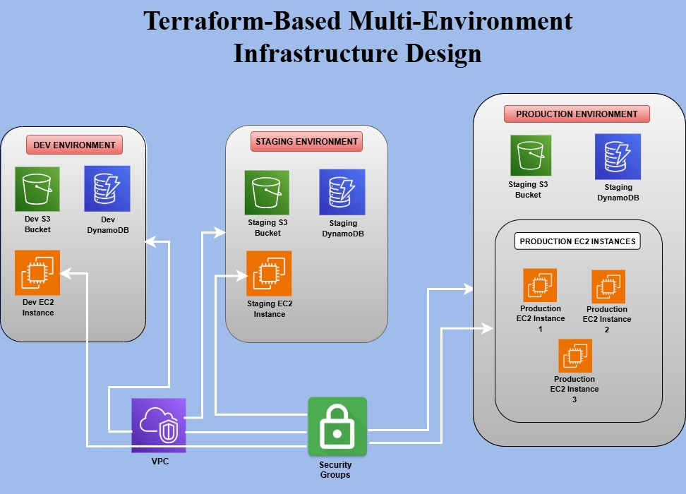

# Terraform Multi-Environment Infrastructure

This repository demonstrates how to manage and deploy **multiple environments (Dev, QA, Prod)** using **Terraform** on **AWS Cloud**.  
It follows best practices for modular Terraform configuration, remote state management, and environment isolation — making it suitable for production-grade setups.

## Architecture

The following diagram illustrates the multi-environment setup:



### Architecture Overview
- **Terraform Workspaces** are used to isolate environments (`dev`, `qa`, `prod`) while reusing the same infrastructure code.
- **Terraform Modules** define reusable AWS infrastructure components.
- **AWS Services Used:** VPC, EC2, S3, DynamoDB and Security Groups.
- **Remote Backend (Optional):** S3 + DynamoDB for state storage and locking.
- **Outputs** are configured to share resource information between modules and environments.

**Flow Summary:**
Terraform → AWS Provider → Modules → Environment-Specific Infrastructure

## Project Structure

```plaintext
├── aws_infra/
│   ├── main.tf
│   ├── outputs.tf
│   ├── security.tf
│   └── variables.tf
│
├── terra-multi-env/
│   ├── main.tf
│   ├── terraform.tf
│   ├── terraform.tfvars
│   └── terra-multi-env.pub
│
├── docs/
│   └── architecture.png
│
├── .gitignore
└── .terraform.lock.hcl
Explanation:

aws_infra/: Module defining AWS infrastructure (VPC, EC2, Security Groups, etc.)

terra-multi-env/: Root module calling aws_infra with different variables per environment.

docs/: Contains project documentation such as architecture diagrams.

.terraform.lock.hcl: Provider version locking for consistency.

.gitignore: Prevents committing state files or credentials.

```bash

## **Terraform Commands - Complete Guide**
1. Setup & Initialization
Install Terraform
# Linux & macOS
curl -fsSL https://apt.releases.hashicorp.com/gpg | sudo apt-key add -
sudo apt-add-repository "deb [arch=amd64] https://apt.releases.hashicorp.com $(lsb_release -cs) main"
sudo apt-get update && sudo apt-get install terraform

# Verify Installation
terraform -v
Initialize Terraform
terraform init
Downloads provider plugins
Sets up the working directory
2. Terraform Core Commands
Format & Validate Code
terraform fmt       # Formats Terraform code
terraform validate  # Validates Terraform syntax
Plan & Apply Infrastructure
terraform plan      # Shows execution plan without applying
terraform apply     # Creates/updates infrastructure
terraform apply -auto-approve  # Applies without manual confirmation
Destroy Infrastructure
terraform destroy  # Destroys all managed resources
terraform destroy -auto-approve  # Without confirmation
3. Managing Terraform State
Check Current State
terraform state list  # Lists all managed resources
terraform show        # Shows detailed resource info
Manually Modify State
terraform state mv <source> <destination>  # Move resource in state file
terraform state rm <resource>  # Removes resource from state (not from infra)
Remote Backend (S3 & DynamoDB)
terraform {
  backend "s3" {
    bucket         = "my-terraform-state"
    key            = "global/s3/terraform.tfstate"
    region         = "us-east-1"
    dynamodb_table = "terraform-lock"
    encrypt        = true
  }
}
terraform init  # Reinitialize with remote backend
4. Variables & Outputs
Define & Use Variables
variable "instance_type" {
  default = "t2.micro"
}
resource "aws_instance" "web" {
  instance_type = var.instance_type
}
Pass Variables in CLI
terraform apply -var="instance_type=t3.small"
Output Values
output "instance_ip" {
  value = aws_instance.web.public_ip
}
terraform output instance_ip
5. Loops & Conditionals
for_each Example
resource "aws_s3_bucket" "example" {
  for_each = toset(["bucket1", "bucket2", "bucket3"])
  bucket   = each.key
}
Conditional Expressions
variable "env" {}
resource "aws_instance" "example" {
  instance_type = var.env == "prod" ? "t3.large" : "t2.micro"
}
6. Terraform Modules
Create & Use a Module
mkdir -p modules/vpc
# modules/vpc/main.tf
resource "aws_vpc" "main" {
  cidr_block = "10.0.0.0/16"
}
# Root module
module "vpc" {
  source = "./modules/vpc"
}
terraform init
terraform apply
7. Workspaces (Environment Management)
Create & Switch Workspaces
terraform workspace new dev
terraform workspace new prod
terraform workspace select prod
terraform workspace list
8. Terraform Debugging & Logs
export TF_LOG=DEBUG  # Enable debug logs
terraform apply 2>&1 | tee debug.log  # Save logs
